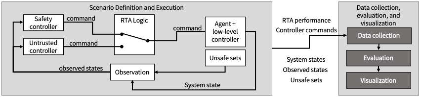
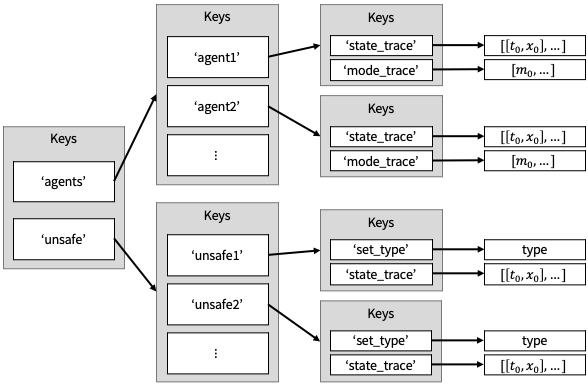
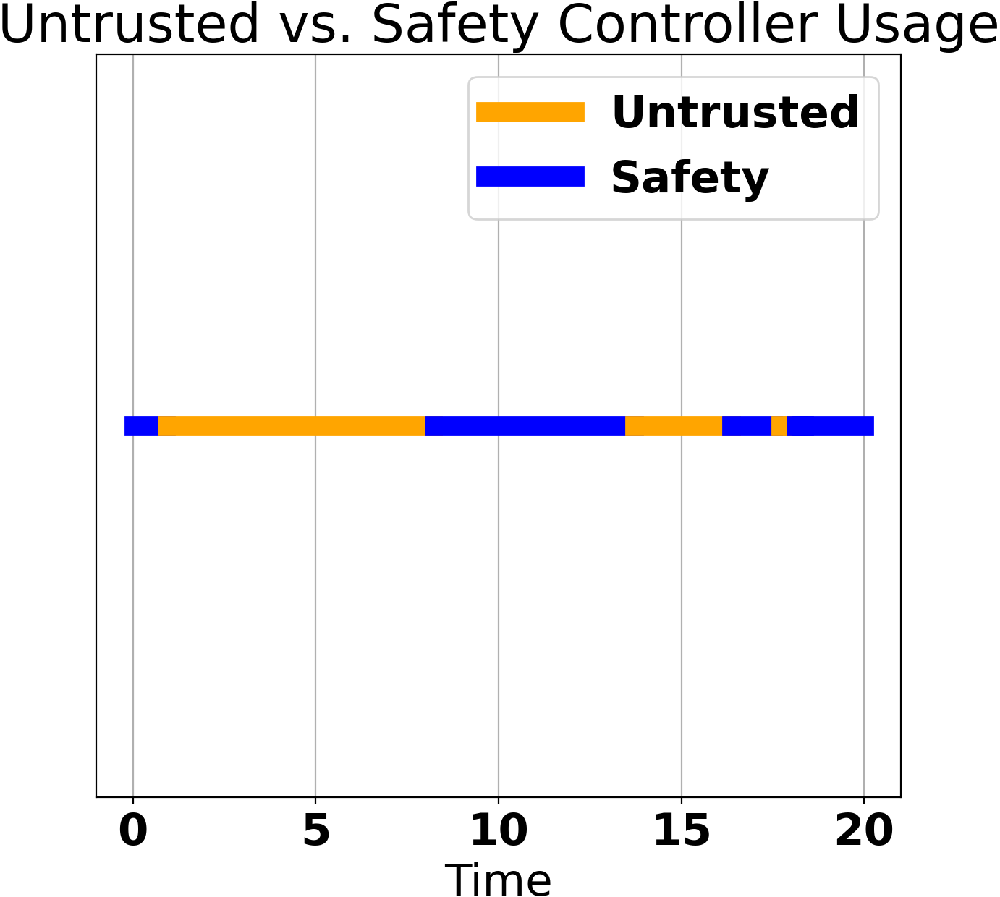
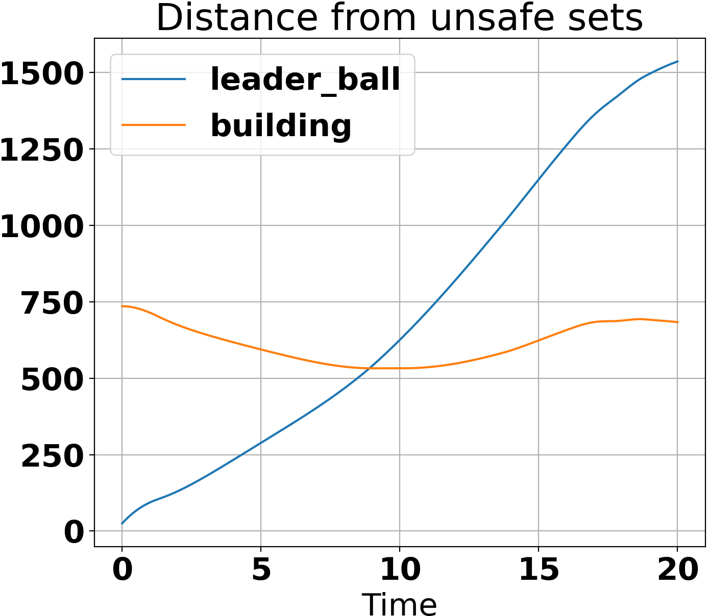
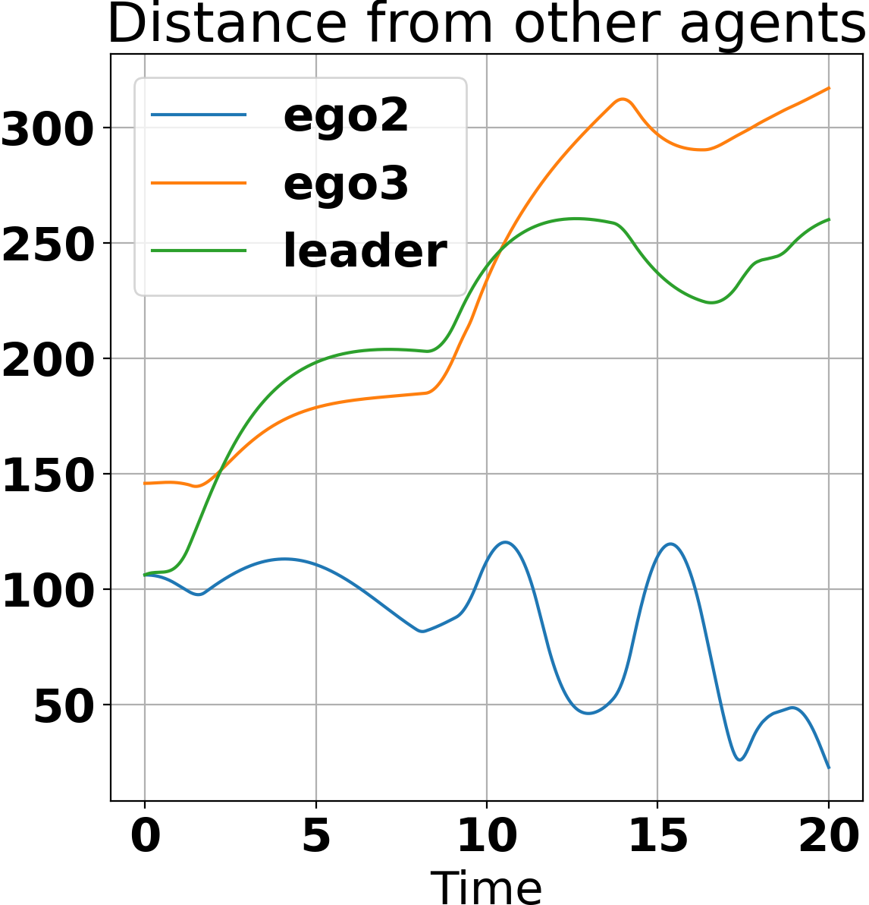

# RTAEval Framework Tool Suite

The RTAEval framework tool suite can be used for designing and evaluating different runtime assurance logics and is written in Python.
The main components are:

- Scenario definition and execution
- Data collection, evaluation, and visualization

An example of the framework is shown below.



A further explanation of the framework is provided in the paper "RTAEval: A framework for evaluating runtime assurance logic".

This README is intended to be a quick start guide for the RTAEval tool suite.

## Required Libraries
- [Matplotlib](https://matplotlib.org/)
- [NumPy](https://numpy.org/)
- [SciPy](https://scipy.org/) 
- [polytope](http://tulip-control.github.io/polytope/)
- [CVXPY](https://www.cvxpy.org/)
- [Yices](https://github.com/SRI-CSL/yices2_python_bindings)
- [Verse](https://github.com/AutoVerse-ai/Verse-library)

## Scenario definition and execution

We provide a simple python simulator that can be used to quickly evaluate RTA different RTA logics.
In this section, we go over the different components needed to run the simulator.
However, users need only provide the scenario execution trace to the data collection tool in order for our evaluation and visualization to work (discussed in the data collection, evaluation, and visualization section).
Scenarios are defined by the:
- agents and low-level controllers,
- unsafe sets,
- safety and untrusted controllers, and
- RTA logic.

First, we discuss the simulation traces that result from the scenario execution.

### Simulation trace

The simulation traces that we collect are a dictionary of the following form
```
{"agents":{
    "agent_id":{
        "state_trace":[[t0,state0], ... ], 
        "mode_trace":[mode0, ...]}, 
    ...}, 
"unsafe":{
    "unsafe_id":{
        "set_type": setType,
        "state_trace":[[t0,setDef0], ... ]},
    ...}
}
```

For each agent in the scenario, the state traces are a list of time-stamped states and the mode trace is a list of modes.
For each unsafe set in the scenario, we need the set type (currently supports relative and fixed points, balls, rectangles, and polytopes), as well as the state trace of the unsafe set, which is a list of time-stamped set definitions.
A visualization of this dictionary is given below.



### Agents

The agents are the systems that are operating in the scenario.
These agents have a state which is updated via a dynamic function, as well as a mode which tells the dynamic function how to update the agent's state. 
When creating an agent to use in our Python simulator, users must create an agent class which has a `step` function to update the agent states.
The agents must also have an associated `id` so they can be identified throughout the scenario execution.

#### Agent dynamics (`step` function)
The agents are updated via a `step` function which takes in a mode, initial condition, the time difference between two time steps, and the current simulator state (in the same dictionary format as the simulation trace).
Its output is the agent state at the next time step.
An example of a step function (taken from the `demos\acc\acc_utils\cc_agent.py`) is given by the following:

```
def step(self, mode, initialCondition, time_step, simulatorState):
    if self.follower:
        self.goal_state = self.desired_traj(simulatorState)
        if mode[0].value == 1:
            self.control = self.no_control
        elif mode[0].value == 2:
            self.control = self.BangBang1D
        else:
            self.control = self.P
            
        self.simulate(mode, initialCondition, 2*time_step, time_step)

    else:
        self.simulate(mode, initialCondition, 2*time_step, time_step)
        
    return self.state_hist[-1]
````
Here, the `step` function takes in the mode, initial condition, time difference between two time steps, and the current simulator state. 
It then uses the mode to decide which controller should be used and updates its state via the `simulate` function.
Finally, it returns the state at the next time step.

#### Agent modes
The agent mode determines what the control input for the agent should be at any time step.
Our evaluation tool currently supports two modes: `UNTRUSTED` and `SAFETY`, however users can still simulate scenarios where other modes are used.
An example of the modes used in the `acc` example can be found in `acc\acc_utils\cc_controller.py`, and is copied below:

```
class ccMode(Enum):
    '''Defines the discrete modes of a single agent'''
    NORMAL = auto()
    UNTRUSTED = auto()
    SAFETY = auto()
```


### RTAs

A runtime assurance (RTA) decision module determines which mode should be used for the agent at any given time step.
We provide a basic RTA class in  `utils/baseRTA.py` called `baseRTA`.
When creating an RTA, users should create a class which inherits the `baseRTA` class.
The user should then provide the `RTALogic` function which takes in the current simulation state (again in the form of the simulation trace dictionary)
and returns the mode in which the agent should operate over the current time step.
The switching is performed via the `RTASwitch` function, which includes some data collection functionality (which will be discussed in Data collection, evaluation, and visualization section). 

#### `RTALogic` function

This is the function that the users must provide when inheriting the `baseRTA` class.
It takes in the current simulation state in the form of the simulation trace dictionary and returns the mode that the agent should operate in over the current time step.

### Unsafe Sets

We provide a variety of unsafe sets that the users can add to a scenario.
These unsafe sets can be either `fixed` (which means that the set definition does not change over time), or they can be `relative` to another agent in the scenario.
hroughout the scenario execution.
Currently, our tool suite supports unsafe sets of the following types: point, ball, rectangle, and polytope.
When initializing the unsafe set, the user must provide the unsafe set `id`, the initial set definition, and, if the set is `relative`, the agent `id` that the set is defined with respect to.
Below, we provide the specific definitions needed for each type of set. 

- **Point** - a point is defined by its `(x,y,z)` center.
- **Ball** - a ball is defined by its `(x,y,z)` center and its radius `r`.
- **Rectangle** - a rectangle is defined by its `(x,y,z)` center and `dx`, `dy`, and `dz`, which are the lengths in the `x`-, `y`-, and `z`-directions respectively.
- **Polytope** - a polytope is defined by an nx3 matrix `A` and an n vector `b`, where the set contains every `p = [x,y,z]` such that `A p <= b`.

### Simulation parameters

We provide the class `simpleSim` to quickly set up and execute scenarios.
When setting up a scenario, we use the following functionality.

#### `addAgents(agents, modes, RTAs, initStates)`
This function adds the agents, RTAs, and initial state of the agents to the scenario.

- `agents` is a list of agents `[agent1, agent2, ...]`.
- `modes` is a list of initial modes used for the agents. It must be given in the same order as the `agents` list, ie. `[agent1Mode, agent2Mode, ...]`.
- `RTAs` is a list of RTAs used for the agents. It must be given in the same order as the `agents` list, ie. `[agent1RTA, agent2RTA, ...]`. If the agent does not have an associated RTA, use `None` instead.
For example, if agent 2 does not have an RTA, the `RTAs` list would be `[agent1RTA, None, ...]`.
- `initStates` is a list of initial states for the agents. It must be given in the same order as the `agents` list, ie. `[agent1initState, agent2initState, ...]`.

#### `addUnsafeSets(unsafeSets)`
This function adds the unsafe sets to the scenario.
Here, `unsafeSets` is a list of unsafe sets.

#### `setSimType(vis, plotType, simType)`
This function defines the visualization parameters for the simulation.
 
- `vis` is a boolean variable that determines if the scenario execution should be visualized in real time. 
If `True`, then a visualization will be shown.
- `plotType` can take on a string value `"2D"` or `"3D"`. 
This determines if the plot shown by the visualization is in 2- or 3-dimensions.
- `simType` can take on a string value `"1D"`, `"2D"`, or `"3D"`. 
It tells the scenario if the physical agent lives in 1-, 2-, or 3-dimensions.
If `simType` is set to `"1D"`, then the first component of the state should be the `x`-position.
If `simType` is set to `"2D"`, then the first component of each agent's state should be the `x`-position and the second component should be the `y`-position.
If `simType` is set to `"3D"`, then the first component of each agent's state should be the `x`-position, the second component should be the `y`-position, and the third component should be the `z`-position.

#### `setTimeParams(dt,T)`
This function sets the time parameters for the scenario execution.
Here, `dt` is the time difference between two time steps and `T` is the upper time bound on the scenario execution.


#### `chooseAxisLimits(axes_type, ref_agent_id, axes_xlim, axes_ylim, axes_zlim)`
This function sets the axes limits for the scenario execution visualization.

- `axes_type` determines if axes limits should be set relative to an agent or the origin. If the axes should be set relative to an agent, choose `"relative"`. If the axes should be set relative to the origin, choose `"fixed"`.
- `ref_agent_id` chooses which agent the axes should be set relative to if `relative` is chosen.
- `axes_xlim`, `axes_ylim`, and `axes_zlim` determine the x-, y-, and z-limits for the axes, given as `[xmin, xmax]`, `[ymin, ymax]`, and `[zmin, zmax]` respectively.
If `xcenter` is the x-value of the point that the axes are set relative to, then the resulting axes limits would be `[xcenter + xmin, xcenter + xmax]`. The same is true for the y- and z-axes limits.

#### `runSim(saveVid, vidFileName)`
This function runs the simulator and returns a simulation trace of the scenario execution. Here, `saveVid` is a boolean variable which decides if the scenario execution should be saved as a video, and
`vidFileName` is a string that decides the file that the video should be saved to.
The videos should be saved as a `.mp4`.

## Data collection, evaluation, and visualization

When a user creates an RTA that inherits `baseRTA`, data collection can also be included.
When initializing the RTA, the user should use the function `setupEval(self, egoID, workspaceDims)`,
where `egoID` is the `id` of the agent that the RTA is associated with, and `workspaceDims` is the 1-, 2-, or 3-dimensional physical space that the agent lives in.
This creates an `eval` object within the RTA.
Each time a decision is made by the RTA module, the `eval` object collects the current simulation state (in the dictionary form of the simulation trace) and saves it to `eval.simulation_trace`.
It also collects the time it takes for the RTA logic to make a decision and saves it to a list `eval.computation_times`.
Then, we provide the following evaluation and visualization functionality:

- `running_times(self)` - this function returns the average, minimum, and maximum times it took for the RTA to make a decision over the scenario.
- `trace_at_min_RT(self)` - this function returns the simulation state at the time step where the RTA made the quickest decision.
- `trace_at_max_RT(self)` - this function returns the simulation state at the time step where the RTA took the longest to make a decision.
- `controllerUsage(self, showPlot)` - this function returns the percentage that the untrusted controller was used,
the percentage that the safety controller was used, and the number of times that the RTA module switched between the untrusted and safety controllers.
If `showPlot` is set to true, then a plot showing the controller usage over time is shown. 
An example of this plot is shown below.



- `compute_dists(self, showPlot)` - this function returns the minimum distance, maximum distance, and average distances of the ego agent from the unsafe sets.
This function also creates a dictionary `eval.dists` of the form
`{unsafeID:dist, ...}`.
If `showPlot` is set to true, a plot showing the distance of the agent from the unsafe sets over time is shown.
An example is shown below.



- `compute_agent_dists(self, showPlot = False)` - this function returns the minimum distance, maximum distance, and average distances of the ego agent from the other agents.
This function also creates a dictionary `eval.agent_dists` of the form
`{agentID:dist, ...}`.
If `showPlot` is set to true, a plot showing the distance of the agent from the other agents over time is shown.
An example is shown below.



- `compute_unsafe_TTC(self, vel_idx, heading_idx, pitch_idx)` - this function returns the minimum, maximum, and average times to collision of the ego agent with the unsafe sets over the scenario. It creates a dictionary `eval.unsafe_TTC` of the form `{unsafeID:TTC, ...}`. Here, `vel_idx` is the index of the state that is the velocity of the agent, `heading_idx` is the index of the state that is the heading of the agent, and `pitch_idx` is the index of the state that is the pitch of the agent. Note that `heading_idx` and `pitch_idx` can be `None` in the case of scenarios where the agent does not have a heading or pitch angle.
- `compute_agent_TTC(self, vel_idx, heading_idx, pitch_idx)` - this function returns the minimum, maximum, and average times to collision of the ego agent with the other agents sets over the scenario. It creates a dictionary `eval.agent_TTC` of the form `{unsafeID:TTC, ...}`. Here, `vel_idx` is the index of the state that is the velocity of the agent, `heading_idx` is the index of the state that is the heading of the agent, and `pitch_idx` is the index of the state that is the pitch of the agent. Note that `heading_idx` and `pitch_idx` can be `None` in the case of scenarios where the agent does not have a heading or pitch angle. Additionally, note that the velocity, heading, and pitch indices must be the same between both agents.
- `summary(self, showPlots)` - This function provides a summary of the RTA performance over the scenario.
It prints the computation times, distances from the unsafe sets, distances from the other agents, and the controller usage over the scenario.
Note that the times to collision are not included as the agents must have some physical aspect to compute this metric. If `showPlots` is set to `True`, then the controller usage and distance plots are shown.

## Examples provided
In this repository, we provide a few examples in the `demos` folder.
A cruise-control example is provided in `acc` and an example with aircraft following Dubins dynamics are provided in `dubins`.
We also provide two example RTA in `demo_rta`: `simRTA` which simulates the trajectory of the agent forward and checks for safety, and `reachRTA` which uses the Verse library to compute the forward reachable sets of the agent forward and checks for safety.
A description of these scenarios is provided in the RTAEval Examples section of our paper.
We also provide a brief description here.

### Adaptive cruise control (`demos/acc`):
This is a scenario which has one physical dimension.
The goal of the agents is to track a point `d` units behind a leader agent while never getting closer than `c` to the leader.

- **Agents** - the agents are defined in the `acc_utils/cc_agent.py` file. The agent class is given by `ccAgent`, which contains the step function, safety, and untrusted controllers. The agent modes are given in the `acc_utils/cc_controller.py` file. There are three modes: `NORMAL`, which is used by agents that have no control input, `SAFETY` which sets the controller to the PID control, and `UNTRUSTED` which sets the controller to the bang-bang control.
- **Unsafe sets** - the unsafe set is a ball centered on a "leader" agent that operates in the `NORMAL` mode
- **RTAs** - we implement both `simRTA` and `reachRTA` in the `acc_utils/cc_controller.py` file.
The single follower scenario is given in `acc_sim.py`.
Scenarios with two and five followers are given in the `two_acc_sim.py` and `five_acc_sim.py` files respectively.

### Dubins aircraft (`demos/dubins`):
This is a scenario which has either two or three physical dimension.
The goal of the agents is to track a point `d` units behind a leader agent while never getting closer than `c` to the leader.
Additionally, in the three dimensional scenario, the follower agents must also avoid collision with the ground.

- **Agents** - the agents are defined in the `dubins_utils/agent_aircraft.py` file. The leader agent class is given by `AircraftAgent` which provides a constant input to the leader, 
and the follower agent class is given by `AircraftTrackingAgent` which tracks a given goal point.
Both classes contain the step function, and the `AircraftTrackingAgent` class contains the safety and untrusted controllers. 
The agent modes are given in the `dubins_utils/controller_aircraft.py` file. There are three modes: `NORMAL`, which is used by agents that have no control input, `SAFETY` which sets the controller to track some safe point, and `UNTRUSTED` which sets the controller to track the desired, but potentially unsafe point.
- **Unsafe sets** - 
for the two dimensional case, the unsafe set is a ball of radius `c` centered on a "leader" agent, and a building defined as a rectangle.
In the three dimensional case, the unsafe set is a ball of radius `c` centered on a "leader" agent, and the ground which is defined as a polytope.
- **RTAs** - we implement both `simRTA` and `reachRTA` in the `acc_utils/cc_controller.py` file.

The two dimensional scenarios
are given in `simpleDubins.py` (1 follower),
`three_simpleDubins.py` (3 followers), and
`ten_simpleDubins.py` (10 followers).
The three dimensional scenarios are given in 
`dubins_gcas.py` (1 follower), and
`dubins_three_gcas.py` (3 followers).
